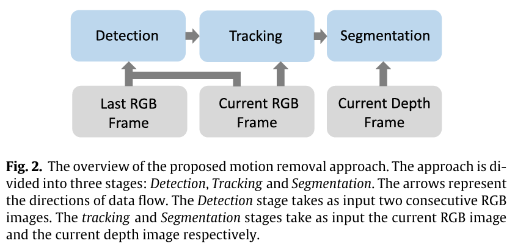
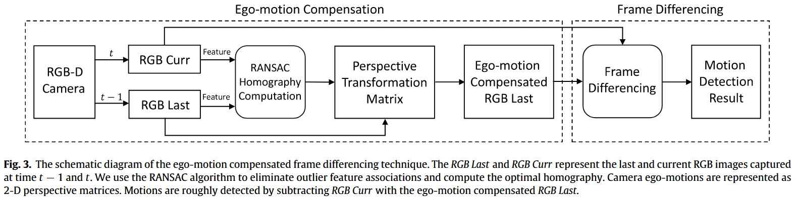

> 创建日期：2025/02/03

## 简介

- 方法分成三个步骤：根据图像差异筛选出大致的移动区域、使用粒子滤波进一步确认移动区域、对量化的深度图使用MAP得到准确的前景（即移动区域）
- 没有参考价值

## 方法

- 图像差异：

    - 对当前帧和上一帧的RGB提取feature，然后使用RANSAC计算2D的透视变换矩阵。
    - 再对图像进行warp，就可以差分了。最后就可以找到移动区域

    

- 粒子滤波：

    - 粒子是图片上的像素
    - 第一次迭代是均匀分布，后续迭代为2D高斯分布
    - 粒子的权重使用与亮度相关的高斯核计算
    - 生成粒子采用[Sequential Importance Resampling (SIR)](https://people.eecs.berkeley.edu/~pabbeel/cs287-fa11/slides/particle-filters++_v2.pdf)，选择其中权重高的粒子

- 基于深度图量化的分割

    - 对深度图进行k-means，然后使用MAP得到前景的分割结果

