InfiniTAMv3

## 简介：新增

- 更加稳定的跟踪模块。可以帮助①（之前就有的）深度图与场景raycast的匹配；②彩色图的匹配。
- 跟踪质量评估模块。从而可以判断是否跟踪失败
- 基于关键帧的相机重定位——随机蕨
- 基于子图（刚性）的地图，会优化子图之间的位姿
- surfel / TSDF 两种地图模式
    - surfel的优点：可以很好的处理动态场景
    - surfel的缺点：可见性与遮挡的计算更加耗时

## 程序实现结构

- 程序设计模式为[责任链模式 (Chain-of-responsibility pattern)](https://www.bilibili.com/video/BV1uk4y127hG)

- 数据结构（例如`ITMImage`）在多个processing engines（例如`ITMTrackingEngine`）之间传递

- 每个engine都是stateless，只对应流程中的一部分，结构如下图

    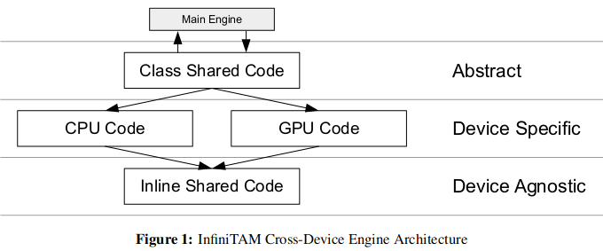

    - Abstract Layer：跟main engine联系，只是包含一些抽象的接口（也可能会包含一些common code）
    - Device Specific Layer：具体实现，分CPU和GPU。也包含OpenMP或者其他加速的代码
    - Device Agnostic Layer：无关设备的实现，都是些内联的代码（C），通常由上层代码调用
    - 例如：在跟踪的engine中，Abstract Layer包含误差函数的优化，Device Specific Layer包含CPU循环或者CUDA核函数来计算图片中每个像素的误差函数，Device Agnostic Layer包含单个像素误差的验证（内联）

- stage通过object进行传递，这些object也包含了处理过的信息

- `ITMMainEngine`包含了所有的object并控制信息流向

- InfiniTAM v3将每个模块（即engine）放到不同的文件夹中

## 地图：哈希 + 体素

- 数据结构 && 对应操作
    - voxel block array：存储融合后的颜色、深度信息
    - hash table && hashing function：用来快速查找voxel block array
    - hash table operation：插入、查找、删除

### Voxel Block Array

- 对应的数据结构是`ITMVoxel\_[s/f]\_[/rgb/conf]`

    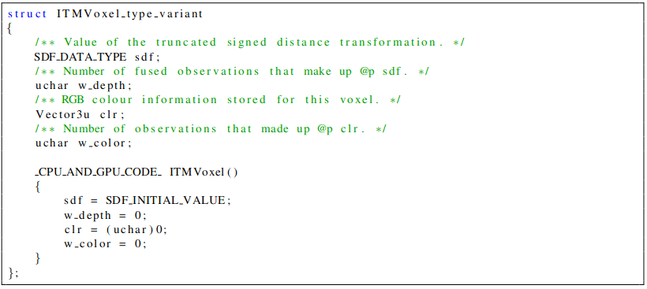

- 所有固定大小、相邻的voxel block作为一组。所有的block存在连续的内存中，所以称作voxel block array（或者VBA）。论文中选取的block范围是8\*8\*8，block数量为2^18^（即2^6^\*2^6^\*2^6^，2^6^=64）

### Hash Table && Hashing Function

- hash table数组连续的数组，对应的数据结构是`ITMHashEntry`

    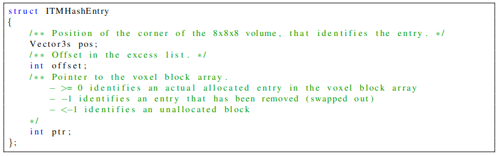

- 哈希函数是`hashIndex()`，输入`blockPos`（也就是voxel block的ID坐标），输出index

    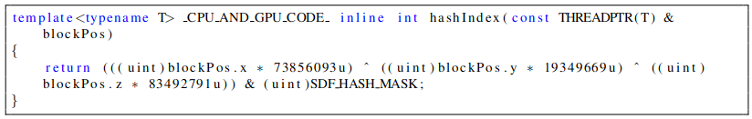

- 为了解决hash collision（哈希冲突），哈希函数输出的index只对应orderd hash table中的一个bucket，然后用额外的unordered excess list来存储bucket中溢出来的数据。所以`ITMHashEntry`在记录index（即上面的ptr）时，还记录offset。结构如下图所示

    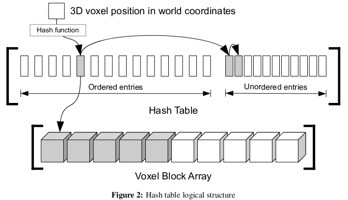

### Hash Table Operation

- 查找/插入操作：

    - 根据世界坐标系 && block size找block pose（即id）
    - 在根据哈希函数找到哈希表中的index
    - 查找index对应的哈希表的bucket中所有内容
    - 如果能找到，找出所需block对应的数据 或者 插入所需数据
    - 如果找不到，则根据bucket中最后一个元素的offset去unordered excess list找，类似指针链表一个个往后找；发现offset≤-1，则停止检索

    > 注意：哈希表unordered部分 && voxel block array 中的查找操作都用到了prepopulated allocation lists，而且CUDA版本用了atomic operation

## Pipeline(处理模块)


- `ITMMainEngine是整个pipeline的入口，pipeline的主要部分是Process Frame
- pipeline有2种：`ITMBasicEngine`（InfiniTAMv2的）、`ITMMultiEngine`（InfiniTAMv3的）
- 总共包含6大模块，如下
    - **tracking**：通过当前帧（depth，可选color）与model的投影进行配准，得到相机位姿
    - **allocation**：为配准好的深度图开辟新的voxel block。具体实现在`ITMSceneReconstructionEngien`（voxel）、`ITMSurfelSceneReconstructionEngine`（surfel）
    - **swapping in**：将内存（地图数据）从host转移到device，即将存起来的数据再拿出来（对应后面的swapping out）。具体实现在`ITMSwappingEngine`。只适用于`ITMBasicEngine`
    - **integration**：将配准好的深度图融合进入三维模型。具体实现在`ITMSceneReconstructionEngien`（voxel）、`ITMSurfelSceneReconstructionEngine`（surfel）
    - **raycast**：将三维模型投影到特定视角下，这样可以用于可视化（`ITMVisualisationEngine`、`ITMMultiVisualisationEngine`、`ITMSurfelViualisationEngine`）和跟踪
    - **swapping out**：将暂时看不到的地方的数据先存起来（因为有时候场景太大，但是内存有限），从device=>host（例如CUDA模式下是GPU显存=>内存，CPU模式下是内存=>硬盘？？？）。具体实现在`ITMSwappingEngine。只适用于`ITMBasicEngine`

### Tracking

- 最抽象的是`ITMTracker`，具体实现派生出如下3类

  - `ITMDepthTracker`：过程中使用了图像金字塔

    - 通过raycast获得model在初始位置（即上一帧位置）下的投影图 && 法向量（用来匹配）
    - 计算投影图与当前depth图的point-to-plane的误差函数
    - 求解线性方程得R、t
    - 重复上述过程直到收敛

  - `ITMColorTracker`：过程中使用了图像金字塔，并下采样4倍

    - 彩色图片=>灰色图片：`I=0.299R+0.587G+0.114B`
    - 通过raycast获得model在初始位置（即上一帧位置）下的投影图 && 匹配（应该也是用法向量找的的???）
    - 计算投影图与当前彩色图的光度误差
    - 用LM优化算法求解R、t

  - `ITMExtendedTracker`：几何误差 + 0.3 * 光度误差，光度误差可以单独禁用

    - 计算depth的误差函数时，使用了Huber-norm（之前是L2norm）
    - 计算depth的误差函数时，不考虑太大的误差（即设置threshold）
    - 给每个像素的depth误差赋予权重：距离远的权重小（因为距离远的噪声大）
    - 求解ICP的R、t之后，使用SVM分类器判定是否跟踪成功。如果跟踪失败，则会调用重定位
    - color的光度误差函数的匹配直接使用depth的匹配关系，重投影过程中会使用双线性插值
    - 通过LM算法求解R、t

    > 因为不同图片的光度之和，所以使用了Tukey loss function，近似后变成了几何误差 + 0.3 * 光度误差，LM算法中的gradient和hessian也是这个权重比

- 程序中的配置方法

  - 默认使用的是`ITMExtendedTracker`（不带color，以适用于只有depth的传感器）
  - 剩下的配置都在`ITMLib/UTils/ITMLibSettings.cpp`

- tracker中，只有计算部分（比如gradient和hessian）是分CPU/CUDA，其他的（比如optimization）都是在main abstract class（应该是`ITMTracker`中？？？）

### Allocation

- 步骤：要求最少使用blocking operation（例如atomics），不能使用critical section

  > blocking operation和critical section好像都是编程操作

  - 将深度图中的每个像素以$[d −µ, d +µ]$的深度投影到空间中成一个线段
  - 将线段所在的block到hash table中查找，找一个空的entry，即如果bucket没有满就找bucket中的，满了则从unordered excess list中找（利用offset）
  - ？？？用两个数组，分别记录对于当前深度图，每个block是否分配、是否可见的信息。每个数组的元素个数跟hash table的一样

  > 注意：如果同一帧深度图的不同像素占用了同一个block，则使用相同的？？？

  - 两个数组中不是0（即占用的、可见的）的entry，会分配voxel block。这个过程会使用原子减法操作，即将可用block的数量减1，并将堆栈的前一个头部添加到hash entry中？？？？（entry不是只记录pose、offset和ptr嘛？）
  - 记录visible frustum中所有的hash entries。后续用于integration和swapping in/out

### Integration

- 步骤：跟KinectFusion几乎一样

  - 对于allocation找到的所有visible voxel block中的每个voxel，使用函数`computeUpdatedVoxelDepthInfo`将新的深度图融合到三维模型里面

    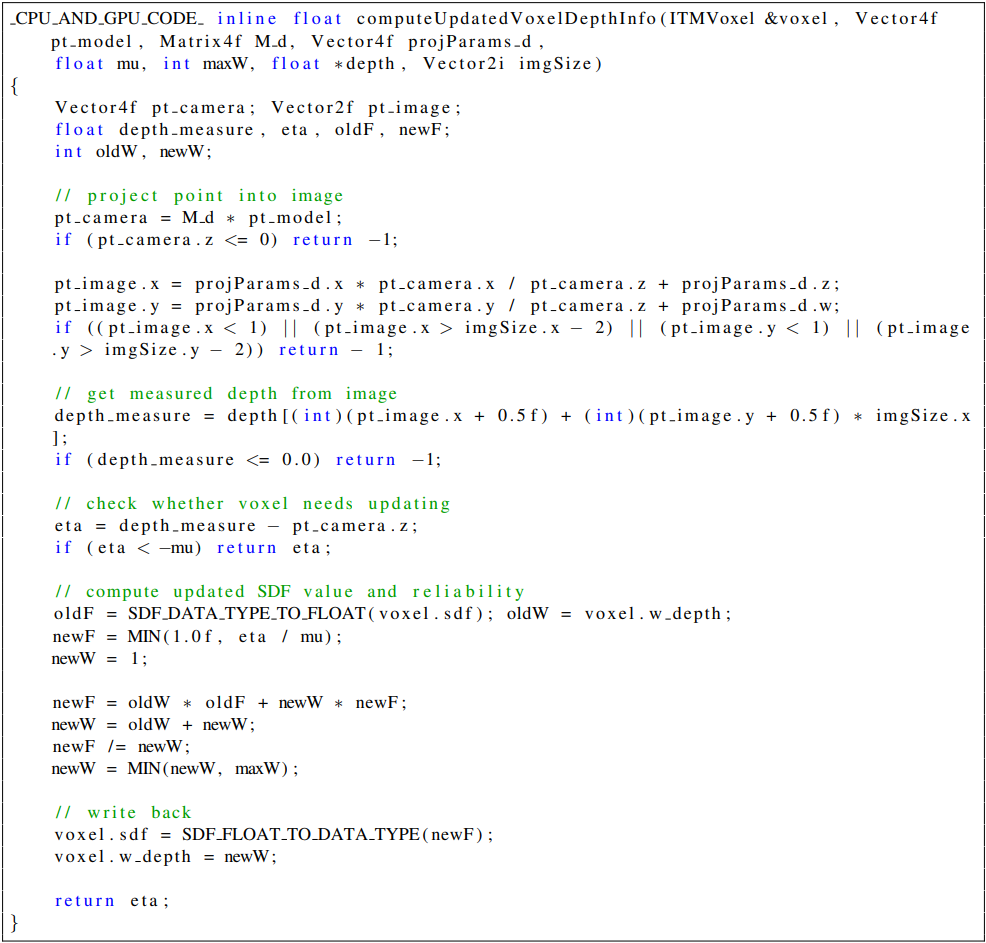

  - surface后面voxel不做任何更新；在surface附近或者前面则会融合

  - **跟KinectFusion唯一不一样的地方**，就是InfiniTAMv3只对可见的voxel block进行更新

### Raycast

- 作用：根据已知的相机位姿和内参，将三维模型投影成图片（depth、color），用于tracking和visualization
- 具体过程可以参考资料
- 优化 * 2
  - 使用更大步长的ray：具体实现在`ITMVisualisationEngine_Shared.h`中的函数`castRay`
    - 首先使用大步长（SEARCH_BLOCK_COARSE = 8 voxels），直到找到allocated block
    - 然后退一大步，再用小步长（SEARCH_BLOCK_FINE），找到SDF值有效的voxel。为正，状态为SEARCH_SURFACE；为负，状态为WRONG_SIDE，退出。
    - 继续找，找到第一个SDF值为负的voxel（状态为BEHIND_SURFACE）后停止
    - 通过两次三线性插值即可找到surface（为啥是两次？）
  - 选择合理的搜索范围：具体实现在`ITMVisualisationEngline`
    - 前面allocation找到了visible block，根据他们的max && mini depth，可以确定一个深度的搜索范围
    - CPU代码中，只是简单将所有blocks投影到图片然后计算2D bounding box（AABB？），结合max && mini depth，可以确定一个3D bounding box
    - GPU代码中，
      - 首先将每个block投影到图片上，计算bounding box（AABB？），然后创建一个16*16的pixel fragment
        - 整个过程可以并行运行
      - 渲染fragment中的每个元素，记录max && mini depth（是将图片划分成16\*16块，计算每一块的max && mini depth？？？）
        - 如果直接计算pixel的的max && mini depth，需要原子操作。但是使用fragment后可以减少成百上千的collisions（假设图片大小为640 \* 480

### Swapping in/out

- 利用allocation的信息，将voxel block分成activate && inactivate。view frustum内部、附近（通过阈值）的是activate，存放在device；其余都是inactivate，存放在host

- 考虑
  - swapping次数（？）要尽可能少，但又要够用
  - host的处理过程要尽可能少
  - 不能假设host的类型（即host可能只是硬盘）

- 设计
  - 所有的memory swap都要经过固定大小（用户定义）的device/host transfer buffer

    - 具体见下面swap in/out的pipeline图

  - 要在host上开辟跟hash table一样大的内存来存放voxel block，这样可以
    - 只通过hash table index就可以知道host memory中是否有hash entry需要的voxel block
    - 从device中移除的voxel block只要标注unavailable，然后在host对应位置标注available（隐式）即可
    - 优点：①保持device和host之间存储voxel block的一致性；②可以快速检查host中三维模型某部分是否可见

  - tracking后，如果已知有voxel block还在host中来不及swap到device，那在device中看来那些位置的block是空的，直接将新的深度图融合进去，等host中的来了，再重新融合一遍

    > 但是block还在host，raycasting怎么投影呢？

- pipeline：跟前面的总pipeline有点区别，swap in和integration的位置不一样

  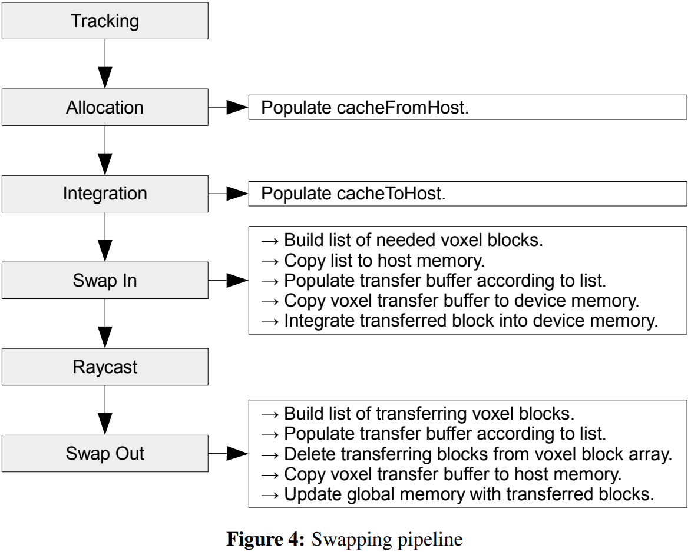

  - swap in的步骤

    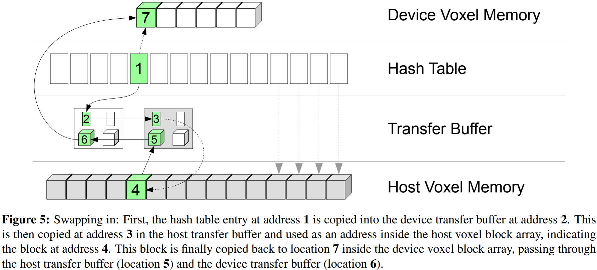

  - swap out的步骤

    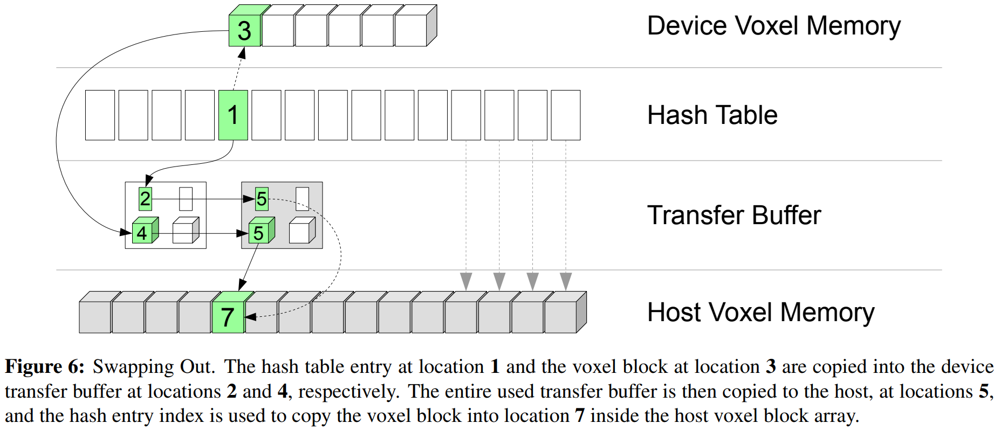 

- 实现

  - 变量和内存都是在`ITMGlobalCache`
  - 操作都在`ITMSwappingEngine`


### Relocalization

- key idea：对关键帧（位姿已知）的编码建立look-up table
- 重定位采用基于关键帧的随机蕨，具体细节网上有很多详解，论文中只是简单提了一嘴，没有详细说
- 优点：实现容易，运行快，在关键帧附近的重定位效果好
- 缺点：新视角下的重定位效果差
- 其他重定位算法例如regression forests[2,10]

### Global -Consistent Reconstruction

- key idea：rigid submap之间的consistent

- 连续多帧重建结果放到一起作为submap，submap内部不做任何调整（也就是rigid），只调整submap之间的相机位姿

- 步骤

  - 整个重建的第1帧的三维model作为一个submap（称为primary submap），之后的帧都融入这个submap

  - 当相机出了当前submap的中间范围（具体？为了让相邻submap之间有重叠）后，就新建一个submap

  - submap分成activate和passive，只有activate用来track

  - 在activate submap之间添加约束；将passive submap与private submap添加约束，用来loop closure detection（利用上面的relocalization）

  - 使用单独的一个线程，周期性进行graph optimisation[5]（是什么？？？）

  - 优化后，可以得到一个globally-consistent map（简称global map），包含了所有submap的pose

  - 在重建的过程中，不会把所有submap的三维model融合到一起，而是通过pose来隐式表示一个完整的三维model
    $$
    \hat{F}(X)=\sum_i F_w(P_i X)F(P_i X)
    $$
    其中，$F$为TSDF值，$F_w$为权重。表示为完整的三维model的位置X的TSDF值，为所有包含它的submap（位姿为$P_i$）的拿出来加权求和。可以用于raycasting

  - 重建完成后，将所有submap融合成一个完整的

- 实现：

  - 整个pipeline中大部分的实现在命名空间`ITMLib`中的类`ITMMultiEngine`
  - 位姿图优化则在`MiniSlamGraphLib`
  - 将命名空间`InfiniTAM`中的`libMode`设置成`LIBMODE_LOOPCLOSURE`，可以开启multi-scene pipeline（可以分开重建多个房间？？？）

- **想要快速了解**，可以从`ITMMultiEngine`的`ProcessFrame`开始

### Surfel-Based Reconstruction

- 除了TSDF这种重建方式，还有surfel[6]
- 每个surfel包含position、normal、radius、confidence count、time stamp
- 步骤
  - 将三维model投影到图像平面上，记录index构成一个index map，用来找correspondence
    - 投影时，理论上圆形的surfel投影后是椭圆，但是还是用圆来近似
    - InfiniTAMv3还没实现surfel的图像金字塔
  - 根据index，将三维model中匹配上的surfel进行融合，如下图；没匹配上的直接新增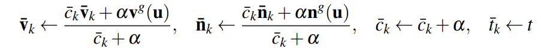
- 实现
  - surfel的实现基本就是参考voxel的
  - scene是类`ITMSurfelScene`
  - surfel有两种类型`ITMSurfel_grey`和`ITMSurfel_rgb`
  - scene重建是`ITMSurfelSceneReconstructionEngine`（及其派生类）
  - scene可视化是`ITMSurfelVisualisationEngine`（及其派生类），关键代码可以见函数`update_depth_buffer_for_surfel`和`update_index_image_for_surfel`
  - 此外还有`ITMDenseSurfelMapper`和`ITMSurfelRenderState`（干啥的？）
- **想要快速了解**，可以从`ITMSurfelSceneReconstrucitonEngine`中的函数`IntergrateIntoScene`先开始
- 缺陷：
  - surfel数量限制，默认5百万（见MAX_SURFEL_COUNT）
  - 没有surfel的remove和merge
  - 优化没有voxel多
  - 没法生成mesh
  - 没有loop closure

## 命名空间

- 命名空间`ITMLib`：pipeline中的几个大模块主要都是在中，此外还包含

  - `ITMLowLevelEngine`：图像预处理（例如图片的copy、gradient、rescale）
  - `ITMViewBuilder`：图片可视化准备（例如depth图的类型转换、法向量计算、双边滤波？？？）
  - `ITMMeshingEngine` && `ITMMultiMeshingEngine`：用marching cube生成mesh
- 命名空间`InputSource`：包含了各种输入（包含传感器）
- 命名空间`FernRelocLib`：包含重定位
- 命名空间`InfiniTAM`：包含UI界面及其功能

## UI && 运行

-  UI界面如下所示，代码实现在`UIEngine`（用到了OpenGL和GLUT）

  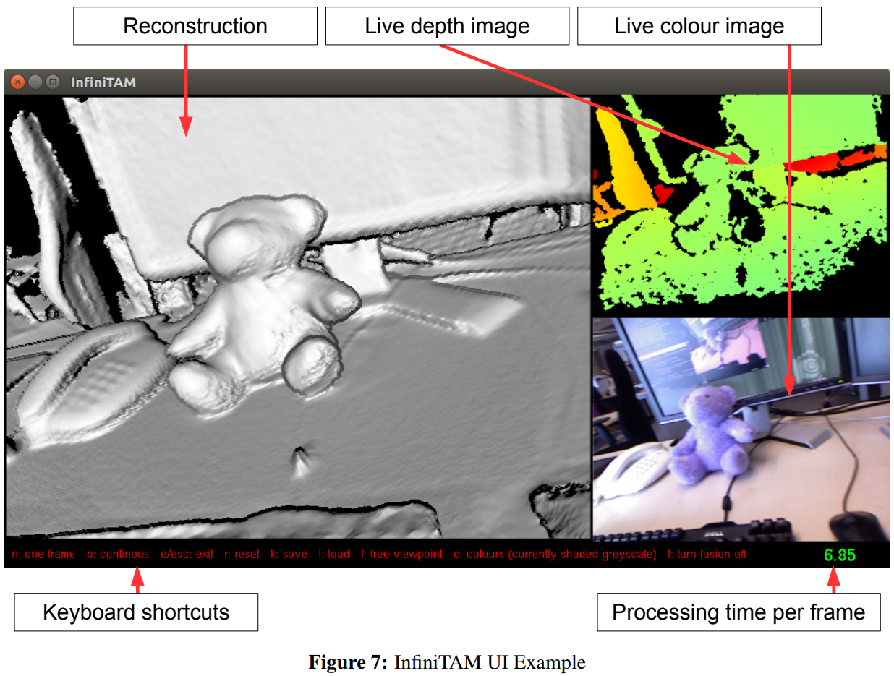

- 相机参数文件

  ```yaml
  640 480     		# 彩色图的长&宽
  504.261 503.905		# 彩色相机的fx & fy
  352.457 272.202		# 彩色相机的cx & cy
  640 480			    # 深度图的长&宽
  573.71 574.394		# 深度相机的fx & fy
  346.471 249.031		# 深度相机的cx & cy
  # 深度相机到彩色相机的外参
  0.999749 0.00518867 0.0217975 0.0243073
  −0.0051649 0.999986 −0.0011465 −0.000166518
  −0.0218031 0.00103363 0.999762 0.0151706
  # 深度图的标定？？？
  1135.09 0.0819141
  ```

- 类`ITMLibSettings`中存放所有设置


