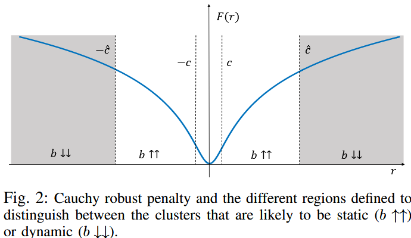
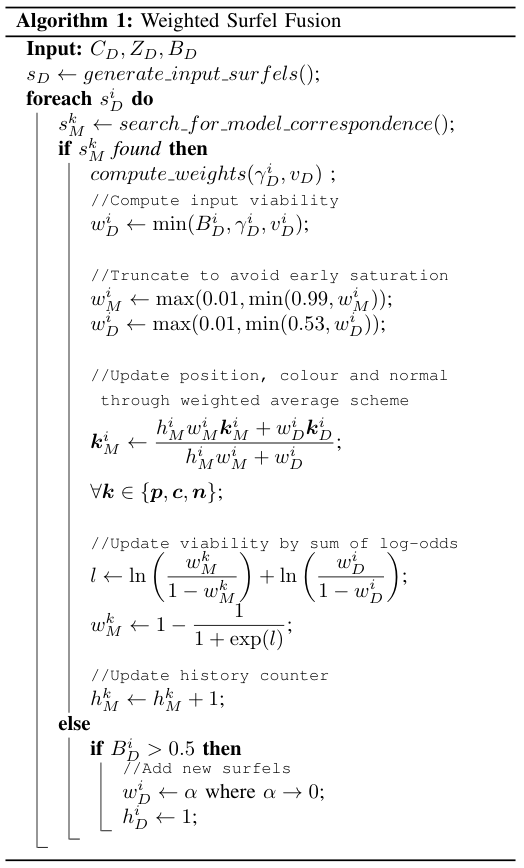

> 创建日期：2024/12/29

## 简介

- keywords: RGBD SLAM、dynamic SLAM
- key idea: 跟踪的同时对单帧进行“动-静”分割（非深度学习方法），然后只融合静态物体，整体算法达到实时（30ms一帧）

## 方法

- 优化目标包含两部分：相机位姿的 && 动-静分割的误差
    $$
    \min _{\boldsymbol{\xi}, \boldsymbol{b}}\{D(\boldsymbol{\xi}, \boldsymbol{b})+S(\boldsymbol{b})\} \quad \text { s.t. } b_i \in[0,1] \quad \forall i
    $$

    - $b$表示每个cluster的动静程度，=0为动态，=1为静态；
    - $\boldsymbol{\xi}$为相机位姿

- 预处理：开始优化上述方程之前，需要 对深度图 做一次K-means，而且假设每一个cluster是rigid的整体

- 相机误差：

    - 首先计算几何误差（只看Z坐标的误差）和光度误差，$M$表示上一帧
        $$
        \begin{aligned}
        r_Z^p(\boldsymbol{\xi}) & =Z_M\left(\mathcal{W}\left(\boldsymbol{x}^p, \boldsymbol{\xi}\right)\right)-\left|T(\boldsymbol{\xi}) \pi^{-1}\left(\boldsymbol{x}^p, Z_D\left(\boldsymbol{x}^p\right)\right)\right|_z \\
        r_I^p(\boldsymbol{\xi}) & =I_M\left(\mathcal{W}\left(\boldsymbol{x}^p, \boldsymbol{\xi}\right)\right)-I_D\left(\boldsymbol{x}^p\right)
        \end{aligned}
        $$

    - 然后将每个像素的两个误差加权求和：
        $$
        D(\boldsymbol{\xi}, \boldsymbol{b})=\sum_{p=1}^N b_{i(p)}\left[F\left(w_Z^p r_Z^p(\boldsymbol{\xi})\right)+F\left(\alpha_I w_I^p r_I^p(\boldsymbol{\xi})\right)\right]
        $$

        - $\alpha_I$是超参，用来平衡几何误差和光度误差

        - $F(r)$是[Cauch核函数](https://arxiv.org/pdf/2302.07238)：不会因为异常值而过度惩罚，$c$是阈值
            $$
            F(r)=\frac{c^2}{2} \log \left(1+\left(\frac{r}{c}\right)^2\right)
            $$
            其函数曲线下图所示

            

        - $w_Z^p$和$w_I^p$表示误差的噪声、惩罚高梯度区域（时间和空间）的遮挡和不连续，$k_\sigma^Z$和$k_\sigma^I$是超参，用来平衡二者
            $$
            \begin{aligned}
            w_Z & =\frac{1}{k_\sigma^Z \sigma_Z^2+\left|\nabla_x Z_D\right|+\left|Z_D-Z_M\right|} \\
            w_I & =\frac{1}{k_\sigma^I \sigma_I^2+\left|\nabla_x I_D\right|+\left|I_D-I_M\right|} .
            \end{aligned}
            $$

- 动-静分割误差：以cluster为单位

    - 首先假设动态物体/cluster（其运动和相机运动明显不符）位于$F(r)$中明显高于$c$的区域，比如曲线的平坦区域（即$\hat c$），则
        $$
        S_D(\boldsymbol{b})=\sum_{i=1}^K 2\left(1-b_i\right) F(\hat{c}) K_i
        $$

    - 然后引入正则项，让相邻的cluster的边界的动-静程度趋于一致
        $$
        S_R(\boldsymbol{b})=\lambda_R \sum_{i=1}^K \sum_{j=i+1}^K G_{i j}\left(b_i-b_j\right)^2
        $$

        - $G_{i j}$表示连通性，cluster $i$和$j$相邻，则为1，否则为0

    - 再添加几何约束，对于每一个cluster，输入深度与参考帧的差异越大、动的可能性也越大
        $$
        S_P(\boldsymbol{b})=\lambda_P \sum_{i=1}^K\left(b_i-b_i^P\right)^2
        $$

        $$
        b_i^P=1-k_p \frac{\sum_{k=1}^{K_i}\left|Z_D\left(\boldsymbol{x}^k\right)-Z_M\left(\boldsymbol{x}^k\right)\right|}{K_i}
        $$

        - $k_p$是超参，控制深度差异到动度的转换

            > ？怎么保证$b_i^P>0$？

    - 最后的目标函数是上面三者的求和
        $$
        S(\boldsymbol{b})=S_D(\boldsymbol{b})+S_R(\boldsymbol{b})+S_P(\boldsymbol{b})
        $$

- 求解：
    - 使用图像金字塔和coarse-to-fine的策略
    - 上一层的分割结果用于初始化下一层的solver
    - 优化目标是convex（why？），先使用iteratively re-weighted least squares (IRLS)求解相机位姿，求解完后获取动-静分割的闭式解（how？）

- fusion：使用surfel模型
    
    
    
    - 给每个像素的权重除了考虑动静程度，还有如下两个
    
        - 高斯权重：距离聚类中心越近的，权重越大
            $$
            \gamma_D^i=\exp \left(-\frac{\left\|\boldsymbol{x}_i-\boldsymbol{x}_c\right\|}{2 \sigma^2\left\|\boldsymbol{x}_c\right\|}\right)
            $$
            
    
        - 速度权重：速度越大，权重越大？
            $$
            v_D=\max \left(1-\frac{1-\max (\|\boldsymbol{\xi}\|, 0.15)}{0.15}, 0.5\right)
            $$
            
    
    - Surfel Viability：相当于可见性，连续多帧可见 && 静态，$w \rightarrow 1$，新surfel的viability为0
    
        - 使用 Log-odds概率 计算Viability：$\text{log-odds} = \log\left(\frac{p}{1-p}\right)$​
            $$
            \operatorname{sign}\left(\ln \left(\frac{w}{1-w}\right)\right)= \begin{cases}-1 & \text { if } w<0.5 \\ 0 & \text { if } w=0.5 \\ 1 & \text { otherwise }\end{cases}
            $$
    
    - surfel移除：
    
        - 如果一个surfel连续10帧$w<0.5$，就被删除
        - 此外，删除viable surfel之前的surfel

## 实施细节

- 初始化：move的像素不能超过20-30%

- 计算误差时的Cauch核函数的超参$c$：正常使用中位数或者MAD(median absoute deviation)，但为了减少计算量，使用均值
    $$
    \bar{r}=\frac{1}{2 N} \sum_{p=1}^N\left|w_Z^p r_Z^p(\boldsymbol{\xi})\right|+\left|\alpha_I w_I^p r_I^p(\boldsymbol{\xi})\right|\\
    c=0.5\bar{r}
    $$

- 分割时的cauch核函数的超参$\hat{c}$：由于“动态分割为静态”待了的误差高于“静态分割为动态”，所以使用偏小的$\hat{c}$，来得到尽可能多的动态区域；此外初始化的时候，要更小，以保证只有静态区域
    $$
    \hat{c}= \begin{cases}\max \left(r_{\min }, \bar{r}\right) & \text { During initialization } \\ 1.5 \max \left(r_{\min }, \bar{r}\right) & \text { Otherwise }\end{cases}
    $$
    其中$r_{min}$是最小误差的阈值（根据单帧质量设定），因为静态物体完美匹配的时候，平均误差$\bar c$会很小，$1.5\bar c$也会很小，导致静态被分割成动态

    