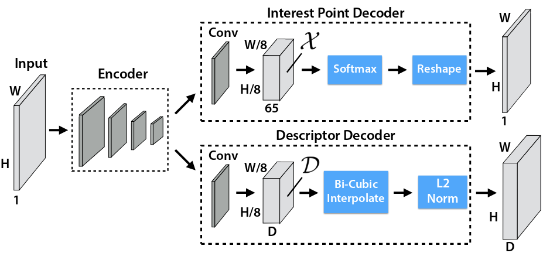
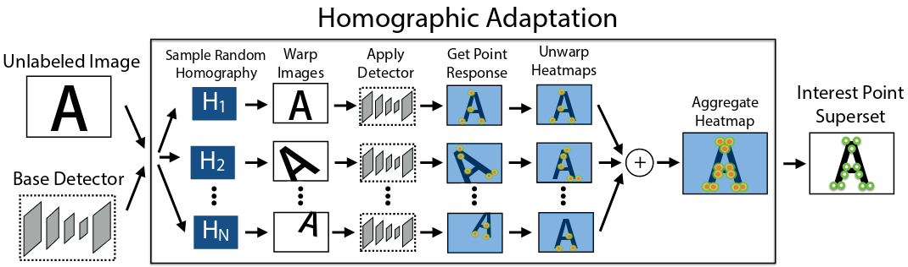
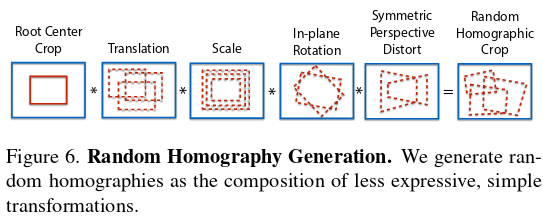

# SuperPoint

> 参考资料：[SuperPoint: Self-Supervised Interest Point Detection and Description](https://patrick-llgc.github.io/Learning-Deep-Learning/paper_notes/superpoint.html)、[笔记：SuperPoint: Self-Supervised Interest Point Detection and Description 自监督深度学习特征点](https://vincentqin.tech/posts/superpoint/)

- interest point的要求：stable and repeatable from different lighting conditions and viewpoints.

- 不好使用supervise方法学习interest point，是因为the notion of interest point detection is semantically ill-defined

- 方法

    

    - 网络结构：为了快，整个网络很小；**输入为灰度图**

        - encoder：来自VGG（使用了**max pooling**），将输入的大小$H_c=H/8,W_c=W/8$

        - interest point decoder：用卷积升维至65（=8\*8+1，8\*8是因为后面要用pixelshuffle，1是no interest point dustbin），经过channel-wise的softmax后，丢弃dustbin的channel，使用pixelshuffle，得到HxWx1的输出

        - descriptor decoder：使用卷积升维至D（设置为256，表示描述子长度），然后用**双线性插值**到原图大小，最后使用L2 norm

        - Loss
            $$
            \begin{aligned} \mathcal{L}\left(\mathcal{X}, \mathcal{X}^{\prime}, \mathcal{D}, \mathcal{D}^{\prime} ; Y, Y^{\prime}, S\right)= \mathcal{L}_p(\mathcal{X}, Y)+\mathcal{L}_p\left(\mathcal{X}^{\prime}, Y^{\prime}\right)+\lambda \mathcal{L}_d\left(\mathcal{D}, \mathcal{D}^{\prime}, S\right)
            \end{aligned}
            $$

            - $\mathcal{L}_p$：for interest point detecotr，将$\mathcal{X}$中每个位置（不做softmax）拿出来跟GT（逆向做pixelshuffle？）计算cross-entropy
                $$
                \mathcal{L}_p(\mathcal{X}, Y)=\frac{1}{H_c W_c} \sum_{\substack{h=1 \\ w=1}}^{H_c, W_c} l_p\left(\mathbf{x}_{h w} ; y_{h w}\right)\\
                l_p\left(\mathbf{x}_{h w} ; y\right)=-\log \left(\frac{\exp \left(\mathbf{x}_{h w y}\right)}{\sum_{k=1}^{65} \exp \left(\mathbf{x}_{h w k}\right)}\right)
                $$

            - $\mathcal{L}_d$：for discriptor，对于经过homography对应的两张图片中距离小于<8像素的点对（即$s_{h w h^{\prime} w^{\prime}}=1$），计算descriptor的loss；考虑到negative correspondence 远远多于 positive，所以用positive margin $m_p$ and negative margin $m_n$
                $$
                \mathcal{L}_d\left(\mathcal{D}, \mathcal{D}^{\prime}, S\right)= \frac{1}{\left(H_c W_c\right)^2} \sum_{\substack{h=1,w=1}}^{H_c, W_c} \sum_{\substack{h^{\prime}=1,w^{\prime}=1}}^{H_c, W_c} l_d\left(\mathbf{d}_{h w}, \mathbf{d}_{h^{\prime} w^{\prime}}^{\prime} ; s_{h w h^{\prime} w^{\prime}}\right)\\
                l_d\left(\mathbf{d}, \mathbf{d}^{\prime} ; s\right)=\lambda_d * s * \max \left(0, m_p-\mathbf{d}^T \mathbf{d}^{\prime}\right)
                +(1-s) * \max \left(0, \mathbf{d}^T \mathbf{d}^{\prime}-m_n\right) .
                $$

    - 阶段一：使用线段、简单多边形来生成数据集，不会存在兴趣点的歧义性，只训练encoder 和 interest point decoder，得到**magic point**

        - 训练的时候，数据集都是on-the-fly生成的
        - 直接用这个阶段的网络识别真实世界，只能识别到strong corner-like structure（例如桌角等）

    - 阶段二：使用不带GT的真实数据集（也没有带GT的，因为兴趣点会存在歧义性），随机选取多个homography（拆分了多个小步骤）进行变换，对每个图提取interest point后变换回去，再和进行融合，得到pseudo GT，在前面magic point的基础上，加入descriptor decoder继续训练，得到**super point**

        - 使用homogrpahy的原因：① 现实世界有很多plane；② 不需要3d信息，比双线性插值效果好多了；③ homograph是self-supervision中常用的手段
        - 选取的homography数量为$N_h$，实验证明$N_h$越大效果越好，但是变大后效果增益越来越小，所以后面选取$N_h=100$

        

        

        
