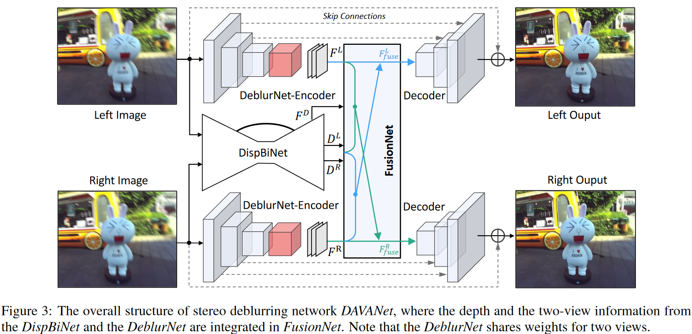
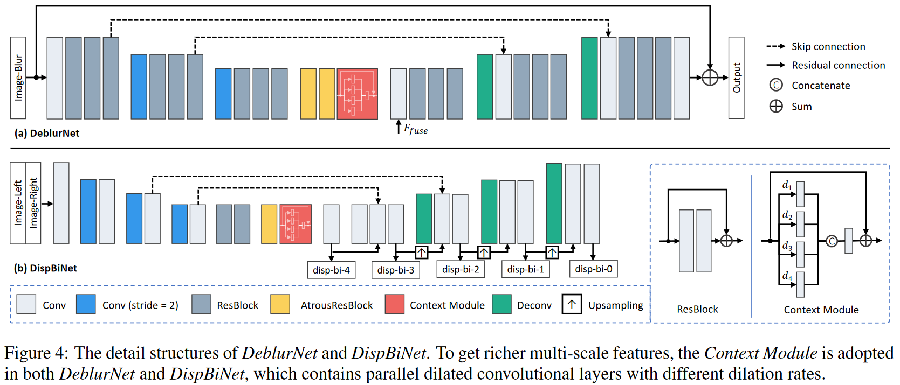
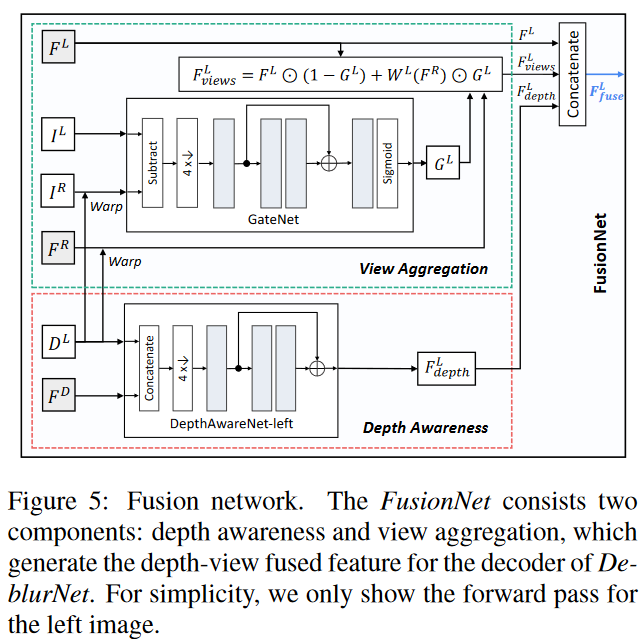
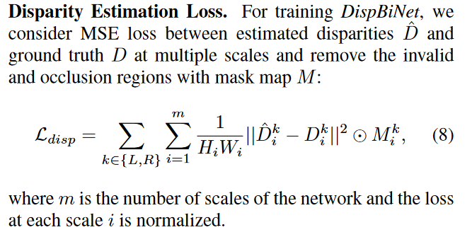
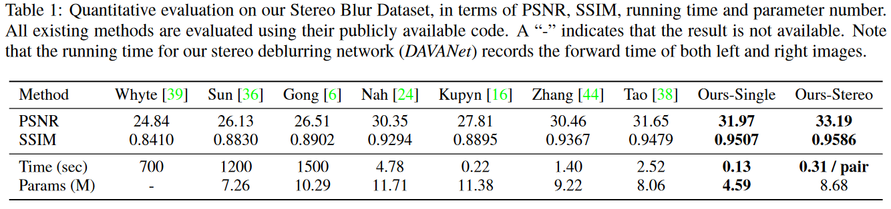
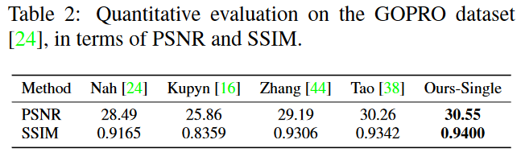
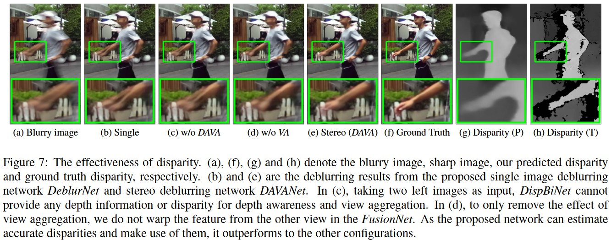
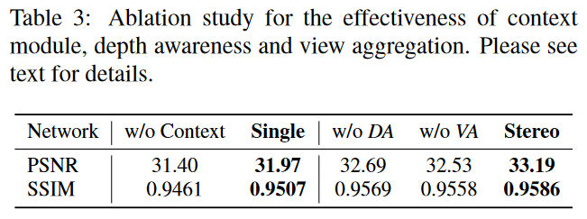

# DAVANet

- 使用stereo进行去模糊，基于两个observation

  - 深度信息可以帮助估计模糊核，因为不同深度的模糊不一样（越远，模糊越小）

  - 左右图像之间的关联可以帮助去模糊。在3.1节证明了，左右图像上相同的物体，会有不同的模糊，因为物体相对于左右相机的平移和旋转不同

    

    - 水平方向平移（上图a）：
      $$
      \triangle X / \triangle P=f/z
      $$

    - 垂直方向平移（上图b）：
      $$
      \triangle X_L / \triangle X_R=\overline{P_t M} / \overline{P_t N} = h/(h+b)
      $$

    - 旋转（上图c）：
      $$
      v_{C_L}  / v_{C_R}=\overline{C_L O} / \overline{C_R O}
      $$

- 相关工作：只有传统的几个方法涉及了stereo deblurring [40,33,28]

- Pipeline：DAVANet分成DeblurNet、DispBiNet、FusionNet，期间有用到context module

  -  左右彩色图像输入DeblurNet的Encoder后分别得到$F^L$和$F^R$
  - 左右彩色图像输入DispBiNet后，得到深度图$D^L$和$D^R$，以及深度特征$F^D$
  - 将$F^L$、$F^R$、$D^L$、$D^R$和$F^D$输入FusionNet，分别得到$F^L_{fuse}$和$F^R_{fuse}$，再通过DeblurNet的Decoder后，加上原图，可以得到左右图片的清晰图

  

  

- DeblurNet

  - 基于UNet，分成Encoder和Decoder，都是residual block
  - Encoder的输出大小为原来的1/4
  - Decoder包含2个upsampled residual block
  - 为了增加感受野，在Encoder和Decoder之间添加了2个atrous（空洞） residual block和1个context module

- Context Module

  - 为了获取多尺度的信息
  - 是ASPP[5]的微调版本

- DispBiNet

  - 基于DispNet，但是同时预测左右图片的深度图，因为光流让两个都预测比只预测一个效果更好[11]
  - 也用了residual block、atrous residual block和context module

- FusionNet

  

  - 步骤一（以左图为例子）：用$I^L$和用$D^L$warp后的$I^R$，通过GateNet得到gate map $G^L$

  - 步骤二：用gate map $G^L$，将$F^L$和用$D^L$warp后的$F^R$结合生成$F^L_{view}$
    $$
    F^L_{view}=F^L\odot(1-G^L)+W^L(F^R)\odot G^L
    $$

  - 步骤三：根据$D^L$，用DepthAwareNet从整个场景的深度特征$F^D$中，提取出左图的深度特征$F^L_{depth}$

  - 步骤四：将$F^L$、$F^L_{view}$、$F^L_{depth}$给concatenate到一起，得到$F^L_{fuse}$

- Loss：

  - 去模糊使用MSE loss + perceptual loss

  - DispBiNet使用MSE loss

    

- Stereo Blur Dataset

  - 包含室内室外、不同光照、不同天气、手持拍摄固定拍摄车载拍摄
  - 步骤一：使用ZED stereo camera拍照（60fps）
  - 步骤二：使用[25]插帧到480fps
  - 步骤三：将连续17、33、49帧合成模糊图，取最中间作为GT
  - 包含135个序列，总共20637对stereo图片，分辨率720P
    - train：98个序列，17319对
    - test：37个序列，3318对，场景跟train不一样（防止过拟合）

- 训练方法

  - 使用Adam，lr从$10^{-4}$开始，每200k减少一半
  - 步骤一：分开训练DeblurNet和DispBiNet
    - DeblurNet用Stereo Blur Dataset训练2000k iter
    - DispBiNet先用FlyingThings3D dataset（剔除视差>90），然后在Stereo Blur Dataset上finetune
  - 步骤二：再加上FusionNet，联合训练500k iter

- 定量和定性的实验结果：

  - 在Stereo Blur Dataset上，效果都最好，耗时和参数量也是最少

    

  - 在GoPro数据集上，仅仅是DeblurNet的效果比其他的也好

    

- 消融实验

  - Effectiveness of the disparity：有效，验证方式如下

    

    - 去除FusionNet中的$I^R$的warp，得到上图d
    - 输入左右图都一样，这样就没有depth信息，得上图c
    - 只用DeblurNet，得到上图b

  - 将ContextModule换成层数一样的卷积块

  - 去掉DispBiNet的loss，这样就学不到depth

  - 令$F^L_{view}=F^L$，从而去除view aggregation（即没有GateNet）的影响

  

