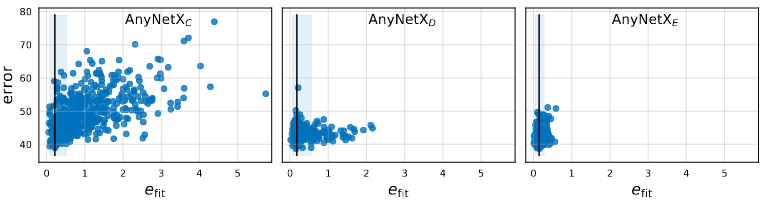
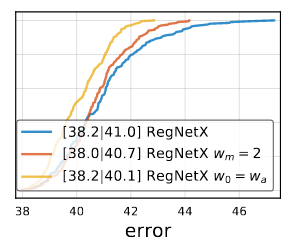

# RegNet

> 参考内容：[RegNet架构复现--CVPR2020](https://developer.aliyun.com/article/1060153)、[RegNet:如何有效地设计神经网络](https://zhuanlan.zhihu.com/p/143999589)

## 简介

- key idea：

  

  - 不像NAS在给定范围内搜索一个具体的网络实例，而是不断减小搜索范围，找到优秀网络的集合（或者叫design space）
    - design space: 
    - NAS不能发掘帮助我们理解的network design principle从而更加generalize地设置网络，而这是本文的目的
    - 跟NAS一样，本文使用semi-automated procedure来达成目标
    - 本文关注design space（例如卷积层个数、通道数等），不关注network structure（例如UNet结构、DenseNet结构等）

  - 网络的宽度和深度可以用一个量化的线性函数来解释
    - 网络宽度：卷积层的channel数量
    - 网络深度：卷积层的数量

  - 跟现有方法相比
    - RegNet在移动端上效率很高
    - RegNet比手工设计的ResNe(x)t效果更好
    - 在相近的训练策略和flops下，与efficientnet相比，效果差不多（甚至更好一点），速度提升5倍

- 相关工作

  - network sacling：通过修改网络的depth、width、resolution，使得网络达到要求的性能（比如更少的flops）
  - comparing network：[21]提出了一种方法可以评判从同一design space的网络的优劣，被本文使用
  - parameterization：

------

## 方法

### 准备

- 评判指标：**EDF(empirical distribution function)**

  

  - key idea：从2个design space中分别采样一些网络并统计他们的误差分布然后比较，这比"从中搜best model再比较"更加robust && informative

  - 公式：$F(e)$表示$n$个model中误差<阈值$e$的占比
    $$
    F(e)=\frac{1}{n} \sum_{i=1}^n \mathbf{1}\left[e_i<e\right]
    $$

  - 误差分析方法：**empirical bootstrap**（一种统计学上的估计方法，[文字教程](https://zhuanlan.zhihu.com/p/24851814)、[视频教程](https://www.bilibili.com/video/BV1o5411p7zq)），
      - 步骤：① 采样25%的网络；② 记录最小的网络error；③ 重复前面两个步骤10^4^次（采样可以重复）；④ 计算95% 置信区间（confidence interval）作为最终结果

- 采样方法：为了更加efficient，采样的时候选择low compute（**400 million flop**）的**100个网络**，并**训练10 epoch**（使用ImageNet dataset）

### AnyNet

- ☆**原始设计空间**：网络包含3部分，用于输入图像的主干（**stem**)、用于进行大量计算的主体(**body**)和用于进行分类的头部(**head**)

  

  - **stem**：个普通的卷积层（后跟`BN+ReLU`），卷积核大小为`3x3`，`stride=2`，卷积核个数为32

  - **head**：由一个全局平均池化层和全连接层构成（因为是做分类任务）

  - **body**：

      - 由4个stage堆叠组成，每个阶段的block数量相同，每个stage都会将feature map的W和H减小一半

      - 每个stage $i$使用的的是带bottleneck和group conv的标准ResBlock，称为**X Block**，可以调整的参数有

          

          - network depth $d_i$ ( block num )
          - block width $w_i$ (number of channels)
          - bottleneck ratio $b_i$（即bottleneck中间的channel是输入的比例）
          - group width $g_i$

  - 原始设计空间对应的网络称为**AnyNetX**，总共有16个自由度（=4个stage\*4个可调整参数）

- 搜索设置：

    - 除非有单独说明，固定图像分辨率$r=244$
    - 参数范围：$d_i<16$，$w_i<1024$（必须为8的倍数），$b_i \in\{1,2,4\}$，$g_i \in\{2^0,2^1,2^2, \ldots, 2^5\}$、
        - 总共可能数为$(16*(1024/8)*3*6)^4\approx 10^{18}$
    - 选取360MF~400MF的500个model，每个model训练10 epoch

- 搜索过程的目标

    - 为了简化设计空间的结构，
    - 为了提高设计空间的可解释性，
    - 为改善或维持设计空间的质量，
    - 保持设计空间的模型多样性

- 搜索过程

    

    - AnyNetX-A：原始的搜索空间对应的网络称

    - AnyNetX-B：每个stage的bottleneck ratio $b$相同

        - 根据empirical bootstrap，发现<2最好

        

        - 让b相同让EDF几乎不变，而且可以让网络更加simple，也更好分析

    - AnyNetX-C：每个stage的group width $g$相同

        - 根据empirical bootstrap，发现>1最好
        - 让g相同让EDF几乎不变，而且可以让网络更加simple，也更好分析
        - 至此，网络的自由度变成了10=4个stage\*2个参数(d&w)+2个参数(b&g)

    - AnyNetX-D：让number of channels $w_{i+1} \geq w_i$，EDF效果最好

    - AnyNetX-E：让network depth $d_{i+1} \geq d_i$，EDF效果最好

        - 至此，网络的总数降低到$O\left(10^7\right)$

### RegNet

- 从AnyNet到RegNet：确定$w_i$和$d_i$

    - 从AnyNetX-E中选择best 20 models，将每个model总的width $w$（卷积channel数量）随block数量 $j$ 增加的折线图绘制出来（下图灰线，注意纵轴为log），可以**近似成一条直线**（下图黑线）
        $$
        w_j=48 \cdot(j+1), 0 \leq j \leq 20
        $$

    

    - 这样会导致stage内部不同的block有不同的width（卷积channel数），但是我们通常想要同个stage里面的block的width相同，所以需要**进一步量化**，得到一个分段常数函数（piecewise constant function）

        - 首先，将上面的公式2转换形式，其中depth d, initial width $w_0 > 0$,  slope $w_a > 0$
            $$
            u_j=w_0+w_a \cdot j \quad \text { for } \quad 0 \leq j<d
            $$
            

        - 再转换形式：引入新的参数$w_m$，对于每个$j$，计算$s_j$使得公式4等于公式3
            $$
            u_j=w_0 \cdot w_m^{s_j}
            $$

        - 这个时候算出的$s_j$是小数，四舍五入变成$\left\lfloor s_j\right\rceil$，就可以得到最终的量化后的每个block的width

        $$
        w_j=w_0 \cdot w_m^{\left\lfloor s_j\right\rceil}
        $$

        > 注意这里的$w_j$跟前面的$u_j$都表示不同block的width，一个是量化前的，一个是量化后的

        - 对于每个stage $i$，其中block width $w_i=w_0 \cdot w_m^i$，block num $d_i=\sum_i \mathbf{1}\left[\left\lfloor s_j\right\rceil=i\right]$

    - 在AnyNetX上测试了上述量化结果：

        - 测试一：先计算$d$，再使用grid search便利$w_0, w_a, w_m$，来最小化mean log-ratio（表示成$e_{fit}$）从而计算$w_i$

            - 结果：从AnyNetX-E中选出最好的2个model（下图实折线），跟使用公式计算的model（虚折线）差不多

            

        - 测试二：将AnyNetX-C/D/E中每个网络的$e_{fit}$画出来

            - the best models in each design space all have good linear fits
            - $e_{fit}$ improves going from AnyNetXC to AnyNetXE

            

- RegNet的搜索范围

    - 6个自由度：$d<64, w_0, w_a<256（8的倍数）,  1.5 \leq w_m \leq 3, b<2, g>1$ 

    - 跟原始AnyNet的对比

         

- RegNet的优化

    - $2 \leq w_m \leq 3$

    - 令$w_0=w_a$，从而化简公式3成$u_j=w_a \cdot(j+1)$

    - 为了保证网络的多样性，没有再做其他的优化（或者叫做限制）

    - 优化后的结果

        

- 通用性验证

    - 之前都是low compute、low epoch进行实验。现在换成了higher flops, higher epochs, with 5-stage networks, and with various block types
    - 结果跟之前一样，说明整个搜索过程具备通用性

## 实验&&分析

- parameter trend：测试不同参数下网络的好坏，发现$b = 1$ and $w_m ≈ 2.5$ are best

    

- Complexity analysis：

    

    - 上图第一行：激活函数比flop更加影响runtime
    - 上图第二行（蓝色实线）：best model中，激活函数与flop的平方根成线性，参数量与flop成线性，runtime同时与flop的线性和平方根有关（因为它与flop和激活函数有关）

- 最终的RegNet：

    - $d<40, w_0 = w_a<256（8的倍数）,  2\leq w_m \leq 3, b=1, g>1$ 
    - 再根据Fig12下一行的图，限制param和激活函数
    - 之后会进一步限制$12\leq d\leq 28$

- 发现使用inverted bottleneck 效果更差

- 发现对于RegNetX输入为224*224效果最好

- 发现使用SE（squeeze-and-excitation）的RegNet称为RetNetY（之前的都叫RegNetX），效果更好

    

- 与现有方法比较

    - 在移动端，与手工设计和NAS的网络比较，效果可以相媲美
    - 跟ResNet和ResNeXt比较，相同flop下，效果更好
    - 在full regime上，与EfficientNet比较：低flop，EfficientNet更好；高flop，RegNetY更好
