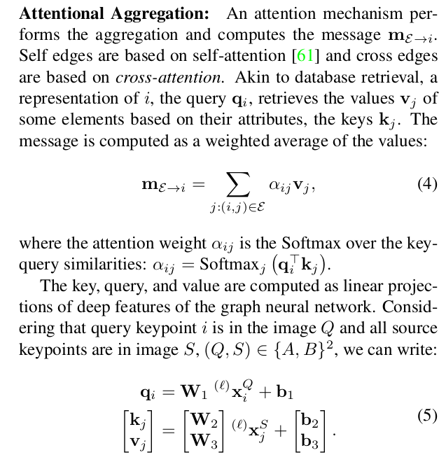

# SuperGlue

> 参考内容：[SuperGlue一种基于图卷积神经网络的特征匹配算法](https://zhuanlan.zhihu.com/p/146389956)

- key idea：

  - 利用现成的特征，从中学习“匹配”
  - 重新审视了经典的基于图的匹配策略，通过解决一个线性分配问题来实现匹配，当将其松弛为最优输运问题时，可以以可微的方式求解
  - 收到transformer的启发，使用了self-和cross-attention。发现在[完全图（complete graph）](https://zh.wikipedia.org/zh-hans/%E5%AE%8C%E5%85%A8%E5%9B%BE)上，self-attention可以被看做是message passing graph neural network
  - 数据集是有GT的
  - 使用NN search的缺点：忽略了分配结构并且丢弃了视觉信息

- related work：

  - graph matching：[quadratic assignment problems（二次分配问题，NP-hard）](https://blog.csdn.net/AS7062031/article/details/108323508)、optimal transport（最优传输，[文章](https://zhuanlan.zhihu.com/p/94978686)，[视频](https://www.bilibili.com/video/BV1Gf4y1q74x)）、[Sinkhorn算法](https://zhuanlan.zhihu.com/p/441197063)（最优传输的一种解法）

- motivation

  - 先验：只要场景静态，可以用极线匹配一对图片
  - 要求①一个keypoint在其他图片上最多1个correspondence；②有些keypoint因为occlusion或者描述子不好，没有匹配

- 方法：

  

  - 输入：前端（比如SIFT或者superpoint）产生的关键点和描述子；

  - 输出：一个partial soft assignment matrix $\mathbf{P} \in[0,1]^{M \times N}$，每个位置的取值范围在0-1，每行、每列的和不超过1（因为上面motivation的要求）

  - Attentional Graph Neural Network

      - 首先，每个keypoint和它对应的descriptor输入keypoint encoder（就是一个MLP）进行融合：

      $$
      { }^{(0)} \mathbf{x}_i=\mathbf{d}_i+\operatorname{MLP}_{\mathrm{enc}}\left(\mathbf{p}_i\right) .
      $$

      ​	疑问：为啥是求和，而不是cat？

      - 然后使用多层GNN：实验设置为9层，感觉计算量会非常大

      - 层与层之间的信息传递如下：将每个node（对应一个keypoint） 连接的所有其他node的信息汇总（如何汇总后面会说），然后跟本节点cat后经过MLP，最后跟本节点求和

          

          - 汇总方法：使用网络的W（权重？）和b（bias？）

              

          - 训练完成后，每一层中，keypoint的用于match的描述子可以表示为
              $$
              \mathbf{f}_i^A=\mathbf{W} \cdot{ }^{(L)} \mathbf{x}_i^A+\mathbf{b}, \quad \forall i \in \mathcal{A}
              $$
              此外，对训练完成后的每一层进行后续匹配，可以发现图片内、图片间的匹配数量以及误差是不断下降的

  - optimal matching layer：对学习到的描述子进行match，根本上是暴力一一匹配？

      - 首先计算两张图片上任意两个描述子的score，假设两张图片上分别有M、N个点，则最终有M*N个score，即矩阵$\mathbf{S}$
          $$
          \mathbf{S}_{i, j}=<\mathbf{f}_i^A, \mathbf{f}_j^B>, \forall(i, j) \in \mathcal{A} \times \mathcal{B}
          $$
          其中，$<·,·>$为inner product

      - 参考superpoint弄一个dustbin通道，在$\mathbf{S}$的两个维度上都加一，变成了$(M+1)*(N+1)$大小的矩阵$\overline{\mathbf{S}}$​，以应对图像中没有特征点的情况
          $$
          \overline{\mathbf{S}}_{i, N+1}=\overline{\mathbf{S}}_{M+1, j}=\overline{\mathbf{S}}_{M+1, N+1}=z \in \mathbb{R}
          $$
          图像A的特征要么与图像B上某个特征点匹配，要么被分配到dustbin，会最终的矩阵P带来如下约束(具体没搞懂)

          

      - 最终，使用Sinkhorn Algorithm来求解最大得分问题，求解后前M\*N就是矩阵P

  

- 实验：

    - 数据集使用ScanNet，可以通过相机轨迹进行重投影来生成GT match；此外可以通过相机轨迹和depth计算两张图之间的overlap，选取overlap不是很大也不是很小的图像对作为数据集

    - 在indoor和outdoor的效果最好，甚至在outdoor上的匹配精度能达到84%，而且跟superpoint结合后效果更好

        

    - 在GTX 1080上可以达到69ms。具体的耗时会跟特征点数量相关

        

