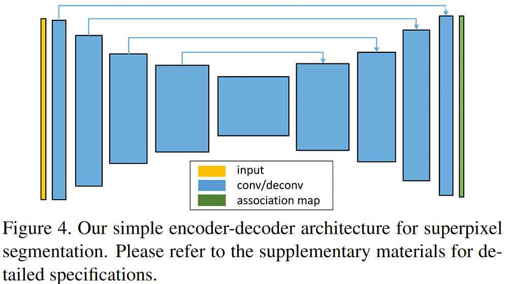

# Superpixel Segmentation with Fully Convolutional Networks

> 参考：[CVPR 2020 | 用SpixelFCN生成与众不同的超像素，它可以用来做什么？](https://zhuanlan.zhihu.com/p/164745942)
>
> 源码：[fuy34/superpixel_fcn (github.com)](https://github.com/fuy34/superpixel_fcn)

- 深度学习不好预测superpixel，∵卷积是regular，用于superpixel很低效

- superpixel可以用于sailency detection[14]（DL），**tracking[37]**，目标检测，语义分割[11,20,24]（DL）

- 相关工作

  - **superpixel综述参考[33]**（源码[davidstutz/superpixel-benchmark](https://github.com/davidstutz/superpixel-benchmark)）
  - 用深度学习提取superpixel的工作有[35]、SSN[16]（网络学pixel feature + 可微的K-Means cluster）
  - [8]提出了CSN网络（convolutional spatial propagation network），**可用于depth completion和refine**，后面会证明跟本文相似
  - 本文跟DCN（deformable convolutional network）相似，因为都是将不规则的像素与规则的grid关联（实现了adaptive respective field；但是DCN中不是每个像素都会有贡献，而本文是每个像素都会被涉及到

- 本文key idea

  - superpixel的提取，就是将图片划分格子，然后将每个像素与格子关联，这个过程叫mapping

  - 为了节约计算量，每个像素只与附近$N_p$（一般是9个）的格子关联（例如下图），整个过程可以用一个tensor表示$G\in Z^{H*W*|N_p|}$

    

  - 本文可以用FCN直接预测上面那个tensor（后面用$Q$表示），即每个像素与周围格子关联的概率（0-1），然后选出最大的即可

  - 这个过程没有解决superpixel大小受限的问题，但是如果superpixel只用于detail-preserverd downsampling/upsampling，那么优点（capture spatial coherence in the local region）> 缺点

- Method

  - 网络 = Encoder + Decoder + leaky ReLU + skip connection + softmax，输出的就是超像素图association map$Q$

    

  - Loss

    - 根据网络输出的association map $Q$，根据每个superpixel附近所有可能像素，计算其中心$\mathbf{c}_{\mathbf{s}}=\left(\mathbf{u}_{\mathbf{s}}, \mathbf{l}_{\mathbf{s}}\right)$ 
      $$
      \mathbf{u}_{\mathbf{s}}=\frac{\sum_{\mathbf{p}: \mathbf{s} \in \mathcal{N}_{\mathbf{p}}} \mathbf{f}(\mathbf{p}) \cdot q_{\mathbf{s}}(\mathbf{p})}{\sum_{\mathbf{p}: \mathbf{s} \in \mathcal{N}_{\mathbf{p}}} q_{\mathbf{s}}(\mathbf{p})}\\ 
      \mathbf{l}_{\mathbf{s}}=\frac{\sum_{\mathbf{p}: \mathbf{s} \in \mathcal{N}_{\mathbf{p}}} \mathbf{p} \cdot q_{\mathbf{s}}(\mathbf{p})}{\sum_{\mathbf{p}: \mathbf{s} \in \mathcal{N}_{\mathbf{p}}} q_{\mathbf{s}}(\mathbf{p})}
      $$
      

      其中，$q_{\mathbf{s}}(\mathbf{p})$表示$Q$中像素$\mathbf{p}$的取值，$\mathbf{f}(\mathbf{p})$表示像素$\mathbf{p}$的特征（自定义，比如颜色等）。通过不同的特征，可以得到不同效果的superpixel

      > 疑问：这里的$\mathcal{N}_{\mathbf{p}}$还是方块状的嘛？我觉得应该不是了

    - 再次计算每个像素的特征和location，即把该像素可能归属的所有超像素加权求和
      $$
      \mathbf{f}^{\prime}(\mathbf{p})=\sum_{\mathbf{s} \in \mathcal{N}_{\mathbf{p}}} \mathbf{u}_{\mathbf{s}} \cdot q_{\mathbf{s}}(\mathbf{p})\\
      \mathbf{p}^{\prime}=\sum_{\mathbf{s} \in \mathcal{N}_{\mathbf{p}}} 1_{\mathbf{s}} \cdot q_{\mathbf{s}}(\mathbf{p})
      $$

    - 最后的Loss为
      $$
      L(Q)=\sum_{\mathbf{p}} \operatorname{dist}\left(\mathbf{f}(\mathbf{p}), \mathbf{f}^{\prime}(\mathbf{p})\right)+\frac{m}{S}\left\|\mathbf{p}-\mathbf{p}^{\prime}\right\|_2
      $$
      其中，$\operatorname{dist}(\cdot, \cdot)$根据自定义的像素特征 设置的distance metric

      - 示例一：像素特征选择CIELAB color vector，$\operatorname{dist}(\cdot, \cdot)$​选择l2，可以得到类似SLIC的loss
        $$
        L_{S L I C}(Q)=\sum_{\mathbf{p}}\left\|\mathbf{f}_{c o l}(\mathbf{p})-\mathbf{f}_{c o l}^{\prime}(\mathbf{p})\right\|_2+\frac{m}{S}\left\|\mathbf{p}-\mathbf{p}^{\prime}\right\|_2
        $$

      - 示例二：类似[16]，像素特征选择语义标签（one-hot encoding），$\operatorname{dist}(\cdot, \cdot)$选择交叉熵
        $$
        L_{s e m}(Q)=\sum_{\mathbf{p}} E\left(\mathbf{f}_{s e m}(\mathbf{p}), \mathbf{f}_{s e m}^{\prime}(\mathbf{p})\right)+\frac{m}{S}\left\|\mathbf{p}-\mathbf{p}^{\prime}\right\|_2
        $$

  - 本文与CSP[8]的关联

    - 同：CSP的公式表示形式与本文计算superpixel中心的一样，本文就是将CSP的计算范围和learning weight换掉
    - 异：CSP是为了propagate information to nearby locations，本文是为了compute superpixel centers

- 超像素分割的实验

  - superpixel数量的设置：每256个像素加一个superpixel，例如208\*208图像有超像素16\*16=169个
  - evaluation metrics
    - achievable segmentation accuracy (ASA)：achievable accuracy for segmentation using the superpixels as preprocessing step
    - boundary recall and precision (BRBP)：boundary adherence of superpixels given the ground truth
    - compactness (CO)：the compactness of superpixels
    - **注意**：为了保证超像素之间的联通性（因为有些验证需要），使用了SSN[16]中的[component connection method](https://github.com/fuy34/superpixel_fcn#prerequisites)，即将小于阈值的superpixel并入周围的
  - 使用了BSDS500、NYUv2数据集

- 双目匹配的实验

  - 本文的超像素分割网络，后面可以接其他下游任务，这里以双目匹配（PSMNet）为例子

    

  - 两种训练方式

    - Ours_fixed：固定FCN，只训练PSMNet
    - Ours_joint：所有网络一起训练

  - 数据集：SceneFlow、HR-VS、Middlebury-v3
