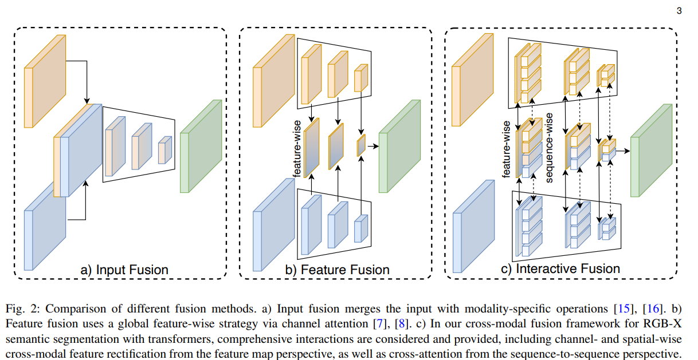
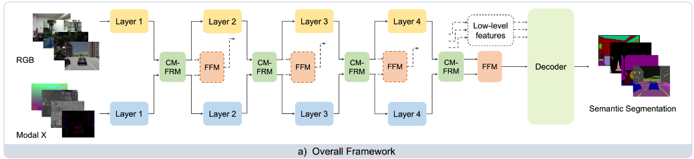
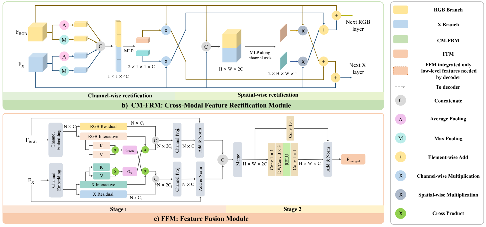

# CMX: Cross-Modal Fusion for RGB-X Semantic Segmentation with Transformers

注意：我看的v2版本的

- key idea：

  - 跨模态数据融合进行语义分割任务，用一个网络可以完成RGB-Depth 或者 RGB-Themal 或者 RGB-Polarzation 或者 RGB-Event，只要更换不同的数据类型**（用X表示）**重新训练就好，不用重新设计网络
  - 每个模态的数据都是完备的，所以不能用Fig2 a)的方式进行融合；但是，不同模态有自己独特的噪声，使用另一种模态的数据可以消除噪声
  - 使用两个分支分别提取RGB和X数据，但是中间会有channel-wise和spatial-wise的数据融合以矫正每个模态的噪声。**整个结构高度对称**
  - depth使用HHA格式[111]
  - 同时使用了max pooling和avg pooling，以保留信息

- related work：

  - graph matching：[quadratic assignment problems（二次分配问题，NP-hard）](https://blog.csdn.net/AS7062031/article/details/108323508)、optimal transport（最优传输，[文章](https://zhuanlan.zhihu.com/p/94978686)，[视频](https://www.bilibili.com/video/BV1Gf4y1q74x)）、[Sinkhorn算法](https://zhuanlan.zhihu.com/p/441197063)（最优传输的一种解法）

- 数据融合方法：本文为第三种，channel-wise和spatial-wise的数据融合

  

- 方法：

  

  - 输入RGB和X，分别都走一个分支（结构一样）。每个分支有4层，每一层结束都会将两个分支的数据进行融合，利用CM-FRM和FFM两个模块。**两个分支和每个模块都高度对称**

      - ☆**融合的原因**：每个模态的数据都是完备的，所以不能用Fig2 a)的方式进行融合；但是，不同模态有自己独特的噪声，使用另一种模态的数据可以消除噪声

      

  - Cross-Modal Feature Rectification Module (CM-FRM)

      - **作用**：使用另一模态的数据对当前模态进行filter和calibrate，包含channel-wise and spatial-wise feature rectification，输入两个数据，输出还是两个。
      - 对于RGB和X的feature，首先都进行max pooling 和 avg pooling（为了保留更多的信息），cat后通过MLP，<u>完成channel-wise rectification</u>
      - 同时，将RGB和X的feature在channel维度cat后，使用1*1卷积（相当于对每个位置做MLP）后，与输入feat分别做卷积，<u>完成spatial-wise rectification</u>
      - 最后把数据整合，输出

  - Feature Fusion Module (FFM)

      - **作用**：对两个模态的数据进行信息交换和融合，输入两个数据，输出一个。
      - Stage1：首先将两个输入的feature都展开成HW\*C的维度，然后都使用linear embedding（没找到论文哪儿说是怎么做的，图片中叫channel embedding，论文在后面说channel embedding是个1*1卷积，但是我感觉是个MLP？）分成Residual和Interative，对于后者使用traditional self-attention[25]（即图片中的K、V、G什么的），最后再用个linear embedding后resize到H\*W\*C
      - Stage2：将前面的两个输出cat后使用channel embedding（1*1卷积），再使用加了depth-wise卷积的残差块来进一步挖掘前面channel-wise fusion后的邻域信息

  - 两个分支的backbone（即Overall Framework中的Layer ）可以随意替换，最后使用的Decoder也可以随意替换

  - 3.4节介绍了各种模态数据的表示形式，这里只对depth的感兴趣

      - depth使用的HHA格式。HHA offers a representation of geometric properties at each pixel, including horizontal disparity, height above ground, and the angle the pixel’s local surface makes with the inferred gravity direction, emphasizing complementary discontinuities of RGB images.

