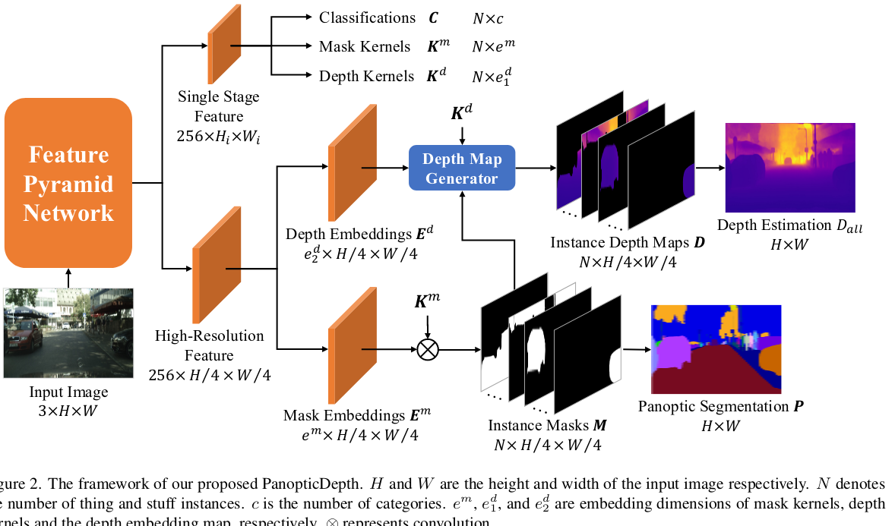

# PanopticDepth

- key idea:

    - 让网络从单张图片中，预测全景分割和深度图。深度图是分instance预测的
    - 使用动态conv分别预测全景分割和深度图的kernel
    - 训练完成后再用全分辨率、更小batch size的进行finetune，可以提升

- 现有方法的问题

    - 现有的全景分割+深度图的工作，没有利用instance信息提升深度图的质量

- 相关工作

    - panoptic segmentation：Panoptic-DeepLab[37-39] 预测 instance center && 每个pixel的offset，感觉很像**superpixel**
    - monocular depth estimation：
        - enhance depth with panoptic segmentation：SDC-depth也是利用instance信息提升depth，但是本文跟他们的区别是
            - SDC-depth只是用instance 信息提升depth，最终只输出depth，而本文是要同时生成分割图和depth图
            - 本文用了一种不同的instance depth normalization scheme
            - 本文用了动态卷积（来自PanopticFCN）

- 方法

    

    - 用FPN（ResNet50）作为backbone，提取feature

    - 使用网络预测得到instance classifications, mask kernels, and depth kernels。depth kernel还包含了两个参数，depth range（即横跨范围）和offset（与相机的距离）。kernel的生成包含两个stage，下面以mask为例，depth的同理

        - kernel generator stage：对于FPN每个stage的feature，生成一个kernel weight map和两个position maps（一个是语义things，用object center表示；一个是实例stuff，用region表示）
        - kernel fusion stage：将前一个stage的信息进行融合得到每个instance的kernel（position maps中取出最大值，与kernel weight map卷积后求占比）

    - 跟PanopticFCN一样，将FPN的feature拿过来用网络转换一下，然后用mask kernel进行conv+sigmoid；再跟[14]一样，丢弃冗余的instance masks，再用argmax从剩下的为每个pixel保存一个就好
        $$
        \begin{aligned}
        & D^{\prime}=\operatorname{Sigmoid}\left(K^d \otimes E^d\right) \\
        & \mathcal{T}_1\left(D \mid D^{\prime}, d^r, d^s\right)=d_{\max } \times\left(d^r \times D^{\prime}+d^s\right) \\
        & \mathcal{T}_2\left(D \mid D^{\prime}, d^r, d^s\right)=d_{\max } \times\left[d^r \times\left(D^{\prime}-0.5\right)+d^s\right]
        \end{aligned}
        $$
        

    - 将FPN的feature拿过来用网络转换一下，同样用depth kernel进行conv+sigmoid。此时得到的depth map是normlized，利用公式4或者5以及前面depth kernel同时预测的两个参数，反norm后就得到了真正的depth map

        - 预测normlized depth，是因为不同的物体远近会差很多，参考BN，就做了一个norm的操作
        - 公式5与instance depth结合的效果更好

- Depth Loss

    - 有两种loss：scale-invariant logarithmic error[70] && relative squared error[71]
        $$
        \begin{aligned}
        \tilde{L}_{d e p}(\mathbf{d}, \hat{\mathbf{d}}) & =\frac{1}{n} \sum_j\left(\log d_j-\log \hat{d}_j\right)^2 -\frac{1}{n^2}\left(\sum_j \log d_j-\log \hat{d}_j\right)^2 \\
        & +\left[\frac{1}{n} \sum_j\left(\frac{d_j-\hat{d}_j}{\hat{d}_j}\right)^2\right]^{0.5}
        \end{aligned}
        $$

    - 同时考虑pixel-level和instance-level的depth误差
        $$
        L_{\text {dep }}=L_{\text {dep }}^P+\lambda_{\text {dep }}^I L_{\text {dep }}^I\\
        L_{d e p}^P=\widetilde{L}_{d e p}\left(D_{a l l}, \hat{D}_{a l l}\right)\\
        L_{d e p}^I=\widetilde{L}_{d e p}\left(d^s, \hat{d}^s\right)
        $$
        

        - pixel-level，计算每个pixel的depth误差
        - instance-level，计算depth offset的误差（depth range蕴含在depth误差里面了）

