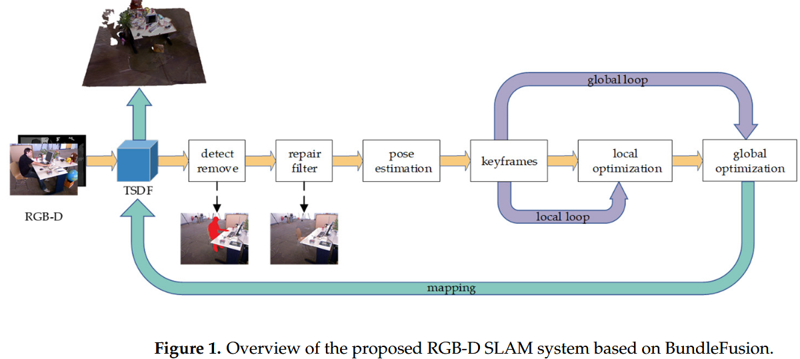
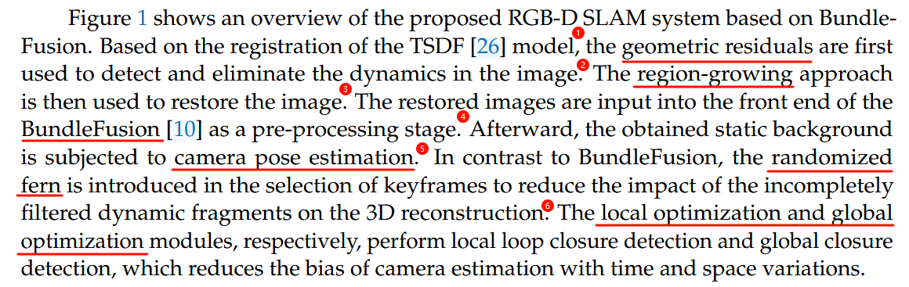

# A Method for Reconstructing Background from RGB-D SLAM in Indoor Dynamic Environments

> 创建日期：2025/02/04

## 简介

- key idea：基于BundleFusion，使用几何残差剔除dynamic，而且在重定位里加入随机蕨防止dynamic的干扰
- 论文很多地方似乎都没有表述清楚，没有说“geometric residuals”是怎么计算的，也没有说“region-growing”的细节。浪费时间！

## 方法

- 大致步骤

    

- 关键帧的选择：连续10帧为一组
    - 初始化的时候，前10帧必须有一帧没有dynamic，作为第一个关键帧
    - 后续，每一组中，以特征点为中心构造n*n大小的grid(???)，然后在参考帧上相同的区域匹配特征。如果匹配不上的数量太多，则认为dynamic太多，不能成为keyframe。然后再使用随机蕨挑选关键帧

