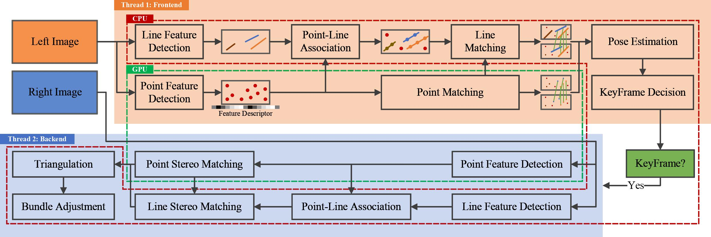

# AirVO

- key idea:

    - 本文引入line特征，但是没有提取其描述子，而是利用点的描述子，这样点的特性（精度高、对光照鲁棒）也就传导到了line上
    - 对superpoint和superglue两个网络使用半精度浮点数，能有5.3x的加速（Jetson AGX Xavier 342ms=>64ms）
    - 使用CPU（以及多线程）、GPU，在Jetson AGX Xavier上，单帧耗时67ms

- 方法：

    

    - **特征匹配**：点+线，点对光照的鲁棒造就了线
        - 用superpoint+superglue从left img上提取point并匹配
        - 使用传统方法（LSD）提取线段，对其中满足如下所有要求的线段进行merge，然后只保留长的线段
            - 角度小于阈值
            - 中点距离小于阈值
            - 两条线在x轴和y轴的投影不重合，且最近的2个端点够近
        - 满足如下所有要求的点-线关联
            - 点到线的距离小于阈值
            - 点落在线的AABB包围盒中
        - 线的匹配。每条线都相当于一个点集。两条线如果同时满足如下所有要求则匹配。
            - 匹配上的点数 占 最小点集 的比例超过阈值（对应论文公式2）
            - 匹配上的点数 超过阈值
    - **位姿估计**
        - 三维直线使用Plücker coordinate表示方法，但由于该方法只有4个自由度，∴在图优化阶段用的是rthonormal representation[48]。两种表示的关系类似$SO(3)$和$so(3)$,
        - 三维直线的三角化，首先使用现有方法[12]，要是失效的话 用线上的点来进行三角化（这个耗时少）
        - 点的重投影就是传统方法，线的重投影用的Plücker coordinate，见公式7和8
    - 满足如下任一要求则是**关键帧**
        - 距离上一关键帧距离或者角度大于阈值
        - 跟踪到的点数在一定范围内
        - 跟踪到的点数大于阈值，但是上一帧跟踪丢了
    - 后端 **图优化**：使用right image
        - 跟ORBSLAM一样，使用了co-visibility graph，vertices为点、线、关键帧，edge为约束
        - 对点和线都计算重投影误差，用于优化

