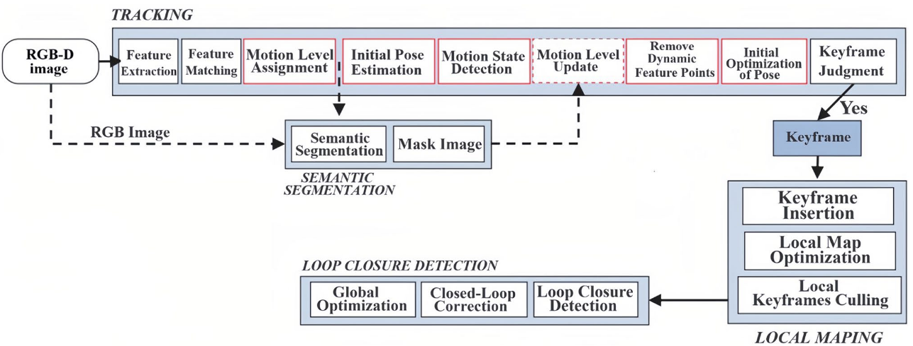
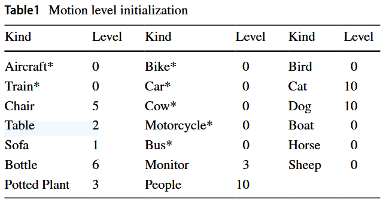
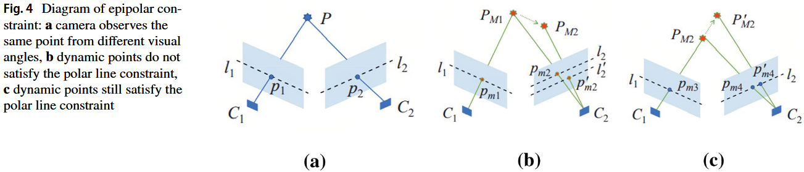
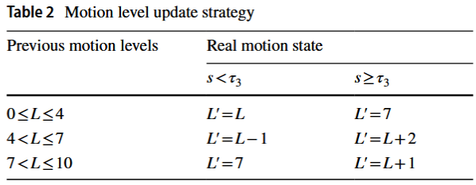

# An RGB-D SLAM algorithm based on adaptive semantic segmentation in dynamic environment

> 创建日期：2025/02/04

## 简介

- key idea：基于ORB-SLAM2，另加一个线程，对需要的帧做语义分割，根据分割结果初始化特征点的“动度”。不做语义分割的帧的动度信息通过“传递”得到
- 评价：“语义信息”让该方法适用面变窄

## 方法

- 语义分割使用RefineNet，使用数据集PASCAL VOC2012数据集训练。不同语义的类别，“动度”不同（范围0-10）

    - 语义分割运行在单独的线程，其结果为feature point初始化 动度
    - 动度在0-4，为static；动度在4-7，为movable static；动度为7-10，为dynamic

    

- SLAM初始化时，所有特征点的动度信息都来自语义分割；初始化完成后，只在部分帧上运行语义分割，其余帧的动度信息通过“传递”得到：

    - 如果能在上一帧or local map中找到匹配点，则用匹配点的动度
    - 否则，在当前帧上在一定半径内，根据RGB和Depth找相似点
    - 还找不到，就到上一个语义分割过的帧找匹配点
    - 都找不到，就是新的点，把“动度”初始化为5

- 计算位姿时使用Huber kernel

- weighted static constraint method : BA优化时，需要进一步区分movable static和dynamic

    - 正常来说，特征点的移动如下图B所示；但在某些视角下，如果特征点沿着视线方向运动（下图C），则满足极线约束（和static混淆）

        

    - 于是定义weighted static constraint score：其中$n$是polar plane的法向量
        $$
        s=\varphi\left|\cos \left(\boldsymbol{n}, \overrightarrow{C_2 p_2^{\prime}}\right)\right|+\omega\left|z\left(P, P^{\prime}\right)\right|
        $$

    - 如果$\cos \left(\boldsymbol{n}, \overrightarrow{C_2 p_2^{\prime}}\right)$大于阈值$\tau_2$，说明夹角很小，为上图C的情况，令$\varphi=1, \omega=0$（只看前半个），直接认为是dynamic；

    - 否则令$\varphi=0, \omega=1$（只看后半个），看depth的差异，再定义阈值$\tau_3$，调整动度

        

