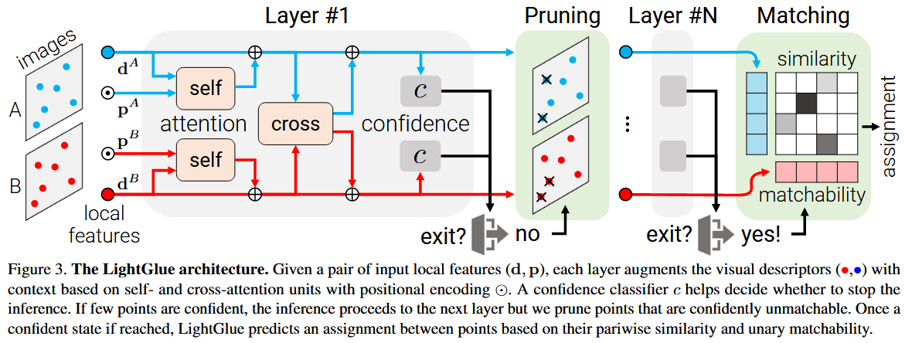
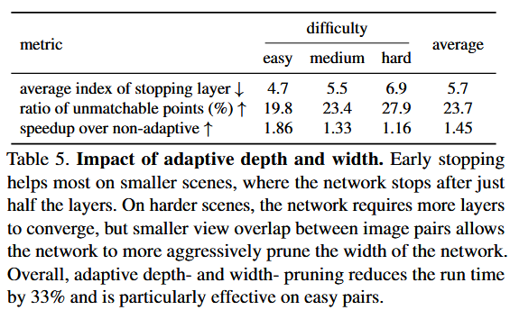

# LightGlue: Local Feature Matching at Light Speed

> 创建日期：2025/02/15

## 简介

- key idea：对SuperGlue改进，增加提前退出机制，并且让不可能存在匹配的点提前删掉。此外，比SuperGlue更好训练

## 方法

- 输入：两张图片的特征点$p$和对应的描述子$d$

- 网络结构：

    - 首先是9个结构一样、串联的layer。每个layer包含两个self-attenson和一个双向的cross-attnsion，最后是一个判断confidence的模块。confidence足够了就跳过剩下的layer
    - 每个layer之间有一个pruning的模块
    - 最后串联一个用于匹配的模块

- 不管是self-还是cross-attension，都在做一样的事情
    $$
    \mathbf{x}_i^I \leftarrow \mathbf{x}_i^I+\operatorname{MLP}\left(\left[\mathbf{x}_i^I \mid \mathbf{m}_i^{I \leftarrow S}\right]\right)\\
    \mathbf{m}_i^{I \leftarrow S}=\sum_{j \in \mathcal{S}} \underset{k \in \mathcal{S}}{\operatorname{Softmax}}\left(a_{i k}^{I S}\right)_j \mathbf{W} \mathbf{x}_j^S
    $$

    - $[\cdot \mid \cdot]$表示stack操作，$i$和$j$和$k$表示特征点点的id，$x$的维度都和描述子一样

    - $\mathbf{m}_i^{I \leftarrow S}$表示$S$中每个点的加权汇总的attension mechanism

    - self-attation中，$x^I$表示描述子or上一layer的输出，$x^S$表示特征点的坐标

    - cross-attation中，$x^I$表示一张图的描述子or它在上一layer的输出，$x^S$表示另外一张图的描述子or它在上一layer的输出

    - $W$表示projection matrix

        > ？？？这个W具体是指啥没说清楚。是可学习的嘛？还是定死的？

    - $a_{i k}^{I S}$则是$I$中的点$i$和$S$中的点$k$的attension scroe

        - 在self-attension中，计算方式为
            $$
            a_{i j}=\mathbf{q}_i^{\top} \mathbf{R}\left(\mathbf{p}_j-\mathbf{p}_i\right) \mathbf{k}_j\\
            \mathbf{R}(\mathbf{p})=\left(\begin{array}{ccc}
            \hat{\mathbf{R}}\left(\mathbf{b}_1^{\top} \mathbf{p}\right) & & \mathbf{0} \\
            & \ddots & \\
            \mathbf{0} & & \hat{\mathbf{R}}\left(\mathbf{b}_{d / 2}^{\top} \mathbf{p}\right)
            \end{array}\right), \hat{\mathbf{R}}(\theta)=\left(\begin{array}{cc}
            \cos \theta&-\sin \theta \\
            \sin \theta & \cos \theta
            \end{array}\right)
            $$

            - $\mathbf{q}$和$\mathbf{k}$就是普通self-attension操作里面将$x$通过不同的linear transformation得到的query和key
            - $\mathbf R(\cdot)$是[rotary encoding](https://zhuanlan.zhihu.com/p/359502624)，其维度和描述子一样，用来记录相对位姿（因为相机平移的时候，特征点之间的相对位姿大体不变）
            - 和[论文Fourier Features](https://zhuanlan.zhihu.com/p/452324858)一样，每个点对应一个2D subspaces。$\mathbf{b}$是可学习的basis，维度为2

        - 在cross-attension中，计算方式为：只用key，不用query
            $$
            a_{i j}^{I S}=\mathbf{k}_i^{I \top} \mathbf{k}_j^S \stackrel{!}{=} a_{j i}^{S I}
            $$

- LightGlue的confidence模块和pruning模块实现了“Adaptive depth and width”的功能：让LightGlue跑得比SuperGlue快

    - 每个layer中每一个点的confidence计算方式如下
        $$
        c_i=\operatorname{Sigmoid}\left(\operatorname{MLP}\left(\mathbf{x}_i\right)\right) \in[0,1] .
        $$

        - 这里的MLP只增加了2%的计算量

    - 然后当前layer的confidence计算方式如下，即统计两张图能匹配的对数的占比，大于一定阈值，就跳过剩下的layer
        $$
        \text { exit }=\left(\frac{1}{N+M} \sum_{I \in\{\Lambda, B\}} \sum_{i \in \mathcal{I}} [[ c_i^I>\lambda_{\ell} ]]\right)>\alpha
        $$

        - $\lambda_{\ell}$和$\alpha$表示单个点和整体占比的阈值
        - 和论文一样《Confident Adaptive Language Modeling》，发现刚开始几层的confidence都偏低，所以会适当降低$\lambda_{\ell}$

    - 如果某一layer的confidence不够，就会先触发pruning模块，即删除confidence很低、同时 unmatchable很高的点

        - unmatchable的定义：重投影误差 或者 depth误差很大

            > ？？？只有在matching模块里才能获取match，进而计算unmatchable吧？难道相邻两个layer之间也有matching模块？为啥不用matching模块中的matchability score

- matching模块

    - 首先计算pairwise score matrix，它的维度=一张图的特征点数 x 另一张图的特征点数，相当于是暴力匹配
        $$
        \mathbf{S}_{i j}=\text { Linear }\left(\mathrm{x}_i^{\Lambda}\right)^{\top} \text { Linear }\left(\mathrm{x}_j^B\right) \quad \forall(i, j) \in \mathcal{A} \times \mathcal{B}
        $$

        - $\text { Linear }\left(\cdot\right)$表示可学习、带bios的linear transformation

    - 同时，给每一个点计算它的matchability score，表示这个点有匹配的可能性
        $$
        \sigma_i=\operatorname{Sigmoid}\left(\operatorname{Linear}\left(\mathbf{x}_i\right)\right) \in[0,1]
        $$

    - 最后将上面两个统一到一个soft partial assignment matrix（和SuperGlue一样）
        $$
        \mathbf{P}_{i j}=\sigma_i^{\Lambda} \sigma_j^B \underset{k \in \mathcal{A}}{\operatorname{Softmax}}\left(\mathbf{S}_{k j}\right)_i \operatorname{Softmax}_{k \in \mathcal{B}}\left(\mathbf{S}_{i k}\right)_j
        $$

        - 矩阵中每一个元素就表示一个匹配，选取$\mathbf{P}$中大于阈值$\tau$、且是它所在行所在列最大 的元素

- 训练的时候：先训练correspondence、然后训练confidence

    - correspondence的损失函数：让尽早的layer预测出正确的匹配，损失函数
        $$
        \begin{aligned}
        \operatorname{loss}=-\frac{1}{L} \sum_{\ell} \left(\frac{1}{|\mathcal{M}|} \sum_{(i, j) \in \mathcal{M}} \log { }^{\ell} \mathbf{P}_{i j} 
         +\frac{1}{2|\overline{\mathcal{A}}|} \sum_{i \in \overline{\mathcal{A}}} \log \left(1-{ }^{\ell} \sigma_i^{\Lambda}\right) 
         +\frac{1}{2|\overline{\mathcal{B}}|} \sum_{j \in \overline{\mathcal{B}}} \log \left(1-{ }^{\ell} \sigma_j^B\right)\right)
        \end{aligned}
        $$

        - 模型时，正样本（匹配正确的点对）和负样本（匹配错误的点对）的损失函数权重被均衡处理，避免某一类样本主导训练过程

    - confidence的损失函数：为binary cross-entropy loss
        - 训练时，一张图上的一个点可呢能对应另一张图上的0个（表示unmatchable）或多个点，matchable的GT则是另一张图上唯一的点

    

    ## 实现

    - 训练和SuperGlue一样

        - 先用数据集1M images+synthetic homographies graphies预训练，这样不会有noise、同时有GT
        - 然后用数据集MegaDepth来fine-tuned，这个数据集用SFM获取相机内参、用multi-view stereo获取depth

    - 网络有9层layer，描述子维度256，使用混合精度、batch size=32（单卡24GB显存）

        > ？？？但是论文中又说都用的3080显卡（显存10GB）

    - 特征点理论上都可以，论文用的SuperPoint、SIFT、DISK

    - 使用单张3080显卡，SuperPoint+5M samples，训练4天不到。完整推理（即9层layer都走）大概20ms，然后难易不一样的耗时不同

        